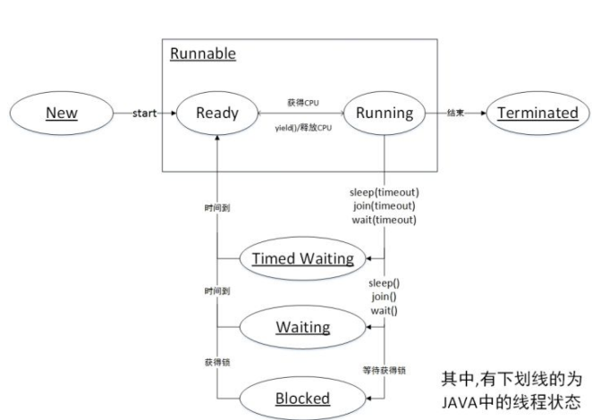

## 〇、目录
1. 什么是线程
1. 线程的创建与运行
1. 线程的通知与等待
1. 等待线程执行终止join的方法
1. 让线程睡眠的sleep方法
1. 让出CPU执行全的yield方法
1. 线程中断
1. 理解线程上下文切换
1. 线程死锁
1. 守护线程与用户线程
1. ThreadLocal

## 一、什么是线程
一个进程中有多个线程，多个线程共享进程的堆和方法区资源，但是每个线程有自己的程序计数器和技区域 。
1. （线程的）程序计数器：记录当前线程的代码执行到哪里
1. （线程的）栈内存：存放当前线程私有的局部变量，其他线程无法访问
1. （进程的）堆内存：堆是一个进程中最大的一块内存，堆是被进程中的所有线程共享的，是进程创建时分配的，堆里面主要存放用 new操作创建的对象实例。
1. （进程的）方法区：存放JVM加载的类、常量及静态变量等信息，也是线程共享的。

## 二、线程的创建与运行
常见的线程创建方式有如下3种
1. 继承Thread类，重写run方法，这样的好处是可以在线程类中自定义局部变量；
1. 实现Runnable接口，实现run方法（也可以通过匿名内部类的方法）；
1. 实现Callable接口，submit到线程池中或者传递给FutureTask类；

## 三、线程的通知与等待
#### wait()方法
在调用锁对象的wait方法时，如果没有实现获取锁对象，则会抛```IllegalMonitorStateException```
当线程通过某个锁变量（假设叫01锁）的wait方法，则只会释放对应的锁（只会释放01锁），对于当前线程可能持有的其他锁（02、03锁等等）将继续持有不释放，造成死锁现象。  
如下代码会造成死锁现象：A线程持有01锁与02锁，但最终调用了02锁的wait方法，这样就只释放了锁02，B线程获取锁01成功，在获取02锁时阻塞；  
```java
public class WaitMethodDemo {

    private static final Object lock01 = new Object();
    private static final Object lock02 = new Object();

    public static void main(String[] args) throws InterruptedException {
        Thread thread01 = new Thread(new Runnable() {
            public void run() {
                try {
                    System.err.println("== thread01 try to get lock01 ==");
                    synchronized (lock01) {
                        System.err.println("== thread01 owned lock01, try to get lock02 ==");
                        synchronized (lock02) {
                            System.err.println("== thread01 owned lock02 ==");
                            System.err.println("== thread01 released lock01 ==");
                            lock01.wait();
                        }
                    }
                } catch (InterruptedException e) {
                    e.printStackTrace();
                }
            }
        });
        Thread thread02 = new Thread(new Runnable() {
            public void run() {
                try {
                    System.err.println("== thread02 try to  get lock01 ==");
                    synchronized (lock01) {
                        System.err.println("== thread02 owned lock01, try to get lock02 ==");
                        synchronized (lock02) {
                            System.err.println("== thread02 owned lock02 ==");
                            System.err.println("== thread02 release lock01 ==");
                            lock01.wait();
                        }
                    }
                } catch (InterruptedException e) {
                    e.printStackTrace();
                }
            }
        });
        thread01.start();
        Thread.sleep(10);
        System.out.println("======= now thread01 owned lock02,released lock01 ==========");
        thread02.start();
    }
}
```
控制台输出（死锁，程序一直不结束）：  
```text
== thread01 try to get lock01 ==
== thread01 owned lock01, try to get lock02 ==
== thread01 owned lock02 ==
== thread01 released lock01 ==
======= now thread01 owned lock02,released lock01 ==========
== thread02 try to  get lock01 ==
== thread02 owned lock01, try to get lock02 ==
```  
##### 虚假唤醒问题（）：
1. 【复习】线程的6种状态（参见Thread.State枚举类）：
    * 新建（NEW）；
    * 可执行（RUNNABLE：包括就绪、运行）；
    * 阻塞（BLOCKED：竞争锁失败）；
    * （主动）等待（WAITING：直到被其他线程唤醒）；
    * 时间等待（TIMED_WAITING：等待一定时间之后继续执行）；
    * 消亡（TERMINATED）；
    
1. 现有如下线程代码：起50个线程，从同一个list里取数据，没有数据的情况下就wait，然后主线程往list里放一个数据，在随机唤醒一个线程，大概率出现数组越界异常  
    ``` java
    public class FakeWakeDemo {
    
        private static final List<Integer> list = new ArrayList<Integer>();
    
        public static void main(String[] args){
            for (int i = 0; i < 50; i++) {
                new Thread(new Runnable() {
                    public void run() {
                        try {
                            synchronized (list) {
                                System.err.println("this is "+Thread.currentThread().getName());
                                if (list.size() < 1) {
                                    list.wait();
                                }
                                System.err.println(Thread.currentThread().getName() + " is going to remove element");
                                list.remove(list.size() - 1);
                                System.err.println(Thread.currentThread().getName() + " remove element success");
                            }
                        } catch (Exception e) {
                            System.err.println("exception happened in "+Thread.currentThread().getName());
                            e.printStackTrace();
    
                        }
                    }
                }).start();
            }
            synchronized (list) {
                list.add(1);
                System.err.println("main thread add element success");
                list.notify();
            }
        }
    }
    ```  
    控制台输出：  
    ```text
    this is Thread-0
    this is Thread-1
    ...
    this is Thread-47
    this is Thread-48
    main thread add element success
    this is Thread-49
    Thread-49 is going to remove element
    Thread-49 remove element success
    Thread-0 is going to remove element
    exception happened in Thread-0
    java.lang.ArrayIndexOutOfBoundsException: -1
    	at java.util.ArrayList.elementData(ArrayList.java:422)
    	at java.util.ArrayList.remove(ArrayList.java:499)
    	at cn.zephyr.ch1.FakeWakeDemo$1.run(FakeWakeDemo.java:27)
    	at java.lang.Thread.run(Thread.java:748)
    ```
1. 什么是虚假唤醒：锁阻塞与线程休眠阻塞是2个不同的队列（个人认为可以理解为：线程的休眠队列、线程的锁阻塞队列），现在有这样一个场景：假设此时有线程A,C买票，线程A调用wait方法进入等待队列，线程C买票时发现线程B在退票，获取锁失败，线程C阻塞，进入阻塞队列，线程B退票时，余票数量+1（满足条件2 等待条件发生），线程B调用notify方法后，线程C马上竞争获取到锁，购票成功后余票为0，而线程A此时正处于wait方法醒来过程中的第三步（竞争获取锁获取锁），当线程C释放锁，线程A获取锁后，会执行购买的操作，而此时是没有余票的。
1. 上述代码可能出现的情况，就是0~48号线程都处于WAITING状态；49号线程竞争锁失败，处于Blocking状态；主线程唤醒0号线程之后，49号线程成功获取锁并执行完业务后，0号线程执行业务报错
1. 解决的办法是条件判断通过```while(list.size() < 1)```来解决，但是有个问题是如果一直没有退票操作线程Notify，while语句会一直循环执行下去，CPU消耗巨大
#### wait(long timeout)方法
在指定的timeout ms时间内，没有被其他线程调用该共享变量的 notify() 或者 notifyAll() 方法唤醒，那么该函数会因为超时而返回。（其实wait方法底层调用的是wait(0)）
#### wait(long timeout,int nanos)方法
其源码如下：  
``` java
public final void wait(long timeout, int nanos) throws InterruptedException {
    if (timeout < 0) {
        throw new IllegalArgumentException("timeout value is negative");
    }

    if (nanos < 0 || nanos > 999999) {
        throw new IllegalArgumentException(
                            "nanosecond timeout value out of range");
    }

    if (nanos > 0) {
        timeout++;
    }

    wait(timeout);
}
```
1ms = 1000 000ns，对参数nanos 其采取了近似处理,即大于半毫秒的加1毫秒,小于1毫秒则舍弃（特殊情况下,参数timeout为0时,参数nanos大于0时,也算为1毫秒）
#### notify()方法
notify()方法的作用是随机唤醒一个通过相同锁对象调用wait方法而阻塞的线程，但这个线程并不是立即执行，而是需要与其他处于就绪状态的线程一样进行锁竞争，只有竞争到了锁才能继续执行（_nofity方法只是让处于阻塞状态的线程重新变为就绪状态，想要进入运行状态还需要cpu调度与锁竞争_）   
与wait方法一样，只有当前线程获取到了对应的锁对象，才能调用锁对象的notify方法，否则会抛```IllegalMonitorStateException```
#### notifyAll()方法
与notify方法类似，也是随机唤醒通过相同锁对象调用wait方法而阻塞的线程，只是这时唤醒的是对应的所有线程

